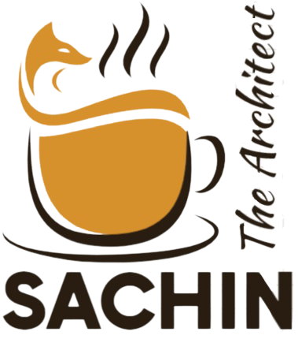

<!-- PROJECT SHIELDS -->
<!--
*** I'm using markdown "reference style" links for readability.
*** Reference links are enclosed in brackets [ ] instead of parentheses ( ).
*** See the bottom of this document for the declaration of the reference variables
*** for contributors-url, forks-url, etc. This is an optional, concise syntax you may use.
*** https://www.markdownguide.org/basic-syntax/#reference-style-links
-->
[![Contributors][contributors-shield]][contributors-url]
[![Issues][issues-shield]][issues-url]
[![LinkedIn][linkedin-shield]][linkedin-url]


<!-- PROJECT LOGO -->
<br />
<p align="center">
  <a href="https://github.com/sachinskumar05/SachinBAMLCodeChallenge">
    
  </a>

  <h3 align="center">Solution</h3>


<p>
Design a Stock Exchange's Matching Engine’s crossing functionality, storing orders and generate any resulting trades from new orders. Below are some of the requirements:
1.	Implement in Java
2.	Be able to handle multiple client connections into the Engine
3.	Solution needs to be thread safe


</p>

  <p align="center">
    This is a code implementation for the task within given time frame!
    <br />
    <a href="https://github.com/othneildrew/Best-README-Template"><strong>Explore the docs »</strong></a>
    <br />
    <br />
    <a href="https://github.com/sachinskumar05/SachinBAMLCodeChallenge">View Demo</a>
    ·
    <a href="https://github.com/sachinskumar05/SachinBAMLCodeChallenge/issues">Report Bug</a>
    ·
    <a href="https://github.com/sachinskumar05/SachinBAMLCodeChallenge/issues">Request Feature</a>
  </p>

<!-- TABLE OF CONTENTS -->
<details open="open">
  <summary>Table of Contents</summary>
  <ol>
    <li>
      <a href="#about-the-project">About The Project</a>
      <ul>
        <li><a href="#built-with">Built With</a></li>
      </ul>
    </li>
    <li>
      <a href="#getting-started">Getting Started</a>
      <ul>
        <li><a href="#prerequisites">Prerequisites</a></li>
        <li><a href="#installation">Installation</a></li>
      </ul>
    </li>
    <li><a href="#usage">Usage</a></li>
    <li><a href="#roadmap">Roadmap</a></li>
    <li><a href="#contributing">Contributing</a></li>
    <li><a href="#license">License</a></li>
    <li><a href="#contact">Contact</a></li>
    <li><a href="#acknowledgements">Acknowledgements</a></li>
  </ol>
</details>


<!-- ABOUT THE PROJECT -->
## About The Project

[![Product Name Screen Shot][product-screenshot]](https://github.com/sachinskumar05/SachinBAMLCodeChallenge)

This is a sample coding challenge solution for BAML.

Here's why I implemented this solution:
* Being enggaged and Focused on creating something amazing. A project that solves a small problem cna be extended for all 
* You shouldn't be doing the same tasks over and over like creating a project from scratch, reuse your own creativity
* You should element DRY principles to the rest of your life :smile:

Of course, there is no perfect solution ever existed howrver, this will serve atleast as a kick starter project and future needs may be different. So I'll be adding more in the near future. Contributers are also requested for opening an issue. Thanks for the motivation

A list of commonly used resources that I find helpful are listed in the acknowledgements.

### Built With

This section should list any major frameworks that you built your project using. Leave any add-ons/plugins for the acknowledgements section. Here are a few examples.
* [Spring Boot](https://spring.io/projects/spring-boot)
* [JDK 8/16](https://www.azul.com/downloads/?package=jdk)


<!-- GETTING STARTED -->
## Getting Started

This is an example of how you may give instructions on setting up your project locally.
To get a local copy up and running follow these simple example steps.

### Prerequisites
This is an example of how to list things you need to use the software and how to install them.

* [Java Editor](https://www.jetbrains.com/idea/download/#section=windows)

### Installation

1. unzip the repo
   ```
   unzip <Application.zip>
   ```


<!-- USAGE EXAMPLES -->
## Usage

Run the Main class to start the project
https://www.jetbrains.com/help/idea/run-debug-configuration-spring-boot.html


<!-- ROADMAP -->
## Roadmap

See the [open issues](https://github.com/sachinskumar05/SachinBAMLCodeChallenge/issues) for a list of proposed features (and known issues).


<!-- CONTRIBUTING -->
## Contributing

Contributions are what make the open source community such an amazing place to be learn, inspire, and create. Any contributions you make are **greatly appreciated**.

1. Fork the Project
2. Create your Feature Branch (`git checkout -b feature/AmazingFeature`)
3. Commit your Changes (`git commit -m 'Add some AmazingFeature'`)
4. Push to the Branch (`git push origin feature/AmazingFeature`)
5. Open a Pull Request


<!-- LICENSE -->
## License

Distributed under the MIT License. See `LICENSE` for more information.


<!-- CONTACT -->
## Contact
Sachin Kumar - [@email]() - sachin.skumar05@gmail.com
Project Link: [https://github.com/your_username/repo_name](https://github.com/sachinskumar05/SachinBAMLCodeChallenge)


<!-- ACKNOWLEDGEMENTS -->
## Acknowledgements
* [Img Shields](https://shields.io)
* [GitHub Pages](https://pages.github.com)
* [Font Awesome](https://fontawesome.com)


[contributors-shield]: images/Contributers.jpg
[contributors-url]: https://github.com/othneildrew/Best-README-Template/graphs/contributors
[linkedin-shield]: images/LinkedIn.jpg
[linkedin-url]: https://www.linkedin.com/in/kumarsac/
[issues-shield]: images/Issues.jpg
[issues-url]: https://github.com/sachinskumar05/SachinBAMLCodeChallenge/issues
[product-screenshot]: images/screenshot.png
